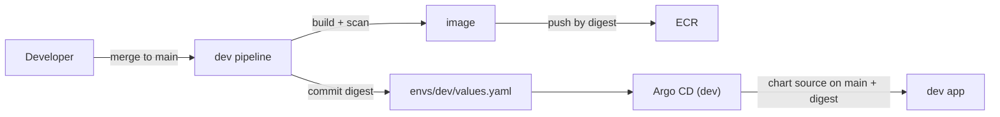
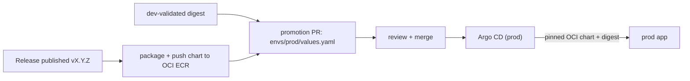

# GitOps

Git is the source of truth for an application's desired state, and Argo CD reconciles the cluster to
match it. Delivery is **trunk-based**: one branch (`main`), environment configuration in directories,
and promotion through a pull request (ADR-014).

!!! warning "Current vs target"
    This page describes the **target** model. Today's **interim**: both environments render the chart
    from `main` and the digest lives in `charts/todolist/gitops/<env>.yaml`; promotion is a direct
    digest commit gated by the `prod` environment reviewer, not yet a pull request. [`GITOPS-HUB`](../tasks.md)
    closes the gap. See [Worked example: TodoList](../onboarding/worked-example.md) for the concrete
    flow.

!!! info "Scope"
    This page is the **model** (why trunk-based, the flow, ownership). For the concrete workflows an
    application uses, see [Onboarding → Pipeline](../onboarding/pipeline.md).

## Two versioned artifacts

| Artifact | How it is versioned | How it is deployed |
|---|---|---|
| **Image** | Built per commit; build tag = commit SHA | Pinned by **digest** |
| **Chart** | Packaged and pushed to ECR as **OCI**, semver version | Pinned by **version** per environment |

Each environment pins **both**: its chart version and its image digest. The digest is the identity;
the chart version freezes the templates.

## Dev loop (continuous)

1. Merge to `main`.
2. CI builds, scans, and pushes the image, then commits the digest to `envs/dev/values.yaml`.
3. Argo CD reconciles dev from the **chart source on `main`** plus that digest.

`main` affects **dev only**.

## Promotion flow (trunk-based)

1. Publish a release (`vX.Y.Z`); the release workflow packages the chart as `X.Y.Z` and pushes it to
   the OCI registry.
2. The promotion workflow opens a **pull request** updating `envs/prod/values.yaml` with the released
   chart version and the **digest dev already validated**.
3. Review and merge the PR — the merge is the approval.
4. Argo CD reconciles prod from the **pinned OCI chart version** plus the promoted digest.

`main` commits never reach prod; the only path is the promotion PR.

## Ownership transfer

Argo CD is the only owner of the application release. When GitOps was introduced, Argo CD adopted the
objects Helm had created (using the same release name, so no duplicates) and the inert Helm release
history was removed. CI never runs `helm upgrade`.

## Rollback

Revert the promotion PR (or open a new one) restoring the previous chart version and digest; Argo CD
reconciles. Image rollback does not revert a schema change — database recovery is handled separately.

## One Argo CD (planned)

Today each cluster runs its own Argo CD. The direction (ADR-013) is a **single Argo CD in prod** that
manages every environment from one view. Because EKS endpoints are private, this needs network
reachability (VPC peering now, a hub/Transit Gateway later).

## Future: add-ons via Argo CD

Today Terraform installs the cluster controllers (Helm provider) and Argo CD owns only the
application. Moving the third-party controllers (ALB controller, ExternalDNS, ESO, metrics-server,
Cluster Autoscaler, ARC) to Argo CD — app-of-apps — would give one reconciliation model for the whole
cluster. Terraform would keep the AWS-managed add-ons, IAM/IRSA, the Argo CD bootstrap, and the
contract. This is future work ([`GITOPS-ADDONS`](../tasks.md)): Terraform works today, so the added complexity
(bootstrap ordering, the IAM split, the migration) is not justified yet.

