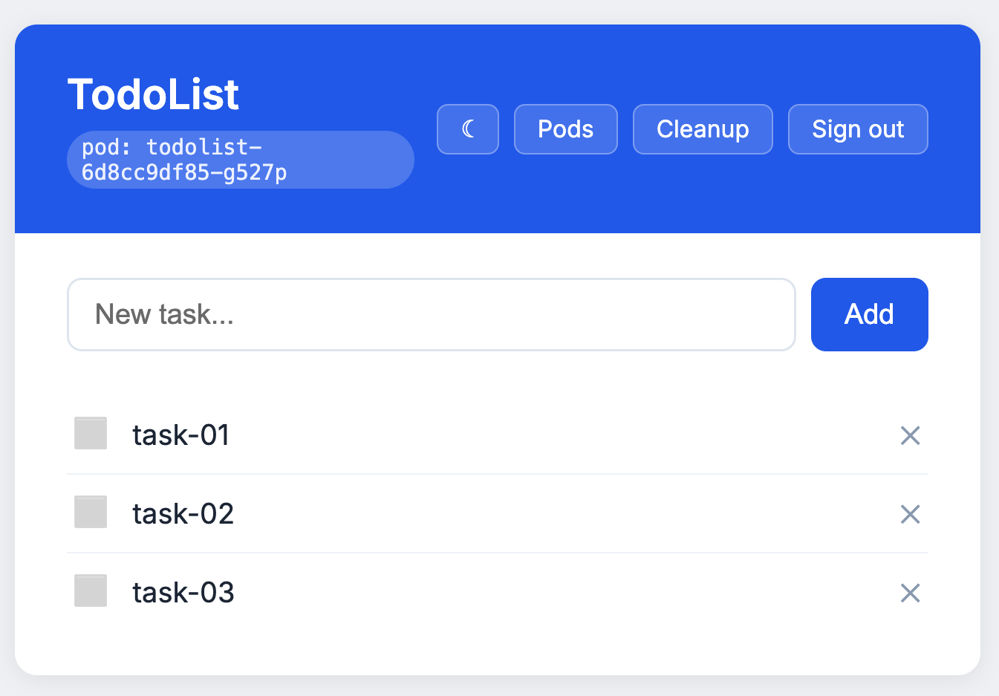

# Use case: TodoList

This handbook exists because of one concrete problem: take a small web application to Kubernetes, the
platform way. This page tells that story end to end — the brief, the framing, the path, and what was
delivered. It is the "why" behind every other page.

## The brief

A Platform Engineering team wants to talk about platform engineering *from the code*. The task:

- **Provision** the infrastructure and dependencies the application needs, automated.
- **Deploy** a new version of the application, automated.
- **Sustain** it: the application must be scalable and resilient.
- **Document** it so someone else can understand and operate it, including the decisions and what was
  discarded.

The application is a Flask + PostgreSQL todo list. Running it is trivial; the work is the path to
production and the decisions along the way.

## Framing: is a single app on Kubernetes the right shape?

A single small application on a Kubernetes cluster is arguably an anti-pattern — the cluster's
control plane, networking, and add-ons cost more attention and money than the app. A serverless shape
(Lambda + API Gateway + a managed database) fits one small service better.

But Kubernetes was a requirement, so the interesting question became: **how do you run it as if it
were one of many applications on a shared platform?** That framing drives every decision here:

- A **platform** repository (the foundation) separate from the **application** repository.
- A **contract** between them, so an application never reads platform internals.
- **One owner per resource**, so the platform and the app never fight.
- A **cost model** and a **budget**, because the foundation is what actually costs money.

See [Architecture](architecture/overview.md) and [Ownership](concepts/ownership.md).

## The path

### 1. Local first

The application runs on a **k3d/k3s** cluster from a single **multi-stage Dockerfile** and a single
**Helm chart**, with a `Makefile` and a beginner's guide. Local is a developer's loop, not a pipeline
stage — but it uses the same chart that runs in the cloud.

### 2. The platform

The AWS foundation is **OpenTofu**, split into reusable modules (VPC, EKS, Aurora, ECR, secrets,
ingress/DNS/TLS, runners, Argo CD) and environment roots (`dev`, then `prod`). State is remote,
encrypted, locked, and kept out of Git. A **budget** with alerts is part of the code.

### 3. Delivery

CI is **GitHub Actions on self-hosted runners inside the VPC**, using **IRSA** (no long-lived keys).
A merge to `main` builds the image, scans it with Trivy (failing on CRITICAL), pushes it to ECR by
**digest**, commits the digest, and smoke-tests the deployment.

### 4. GitOps

**Argo CD** owns the application release; CI never runs `helm upgrade`. The platform publishes
non-secret wiring through the contract (SSM), and the application's chart and per-environment digest
live in the application repository.

### 5. Production and promotion

A second environment (`prod`) demonstrates promotion: a published release promotes the **same
dev-validated digest** through an approval-gated job — no rebuild — and rollback is a digest change.

### 6. Documentation as a service

Because the project grew, the documentation became its own service: **this handbook**, delivered like
any application (built in CI, served as a static site on S3 + CloudFront). Adding it exercised the
platform's onboarding path end to end.

## What was delivered

| Requirement | Where it lives |
|---|---|
| R1 — Provisioned by code | `platform/` (OpenTofu), [runbook](operations/runbook.md) |
| R2 — Automated deployment | GitHub Actions + Argo CD, [pipeline](onboarding/pipeline.md) |
| R3 — Browser access | Route 53 → ALB (ACM TLS) → Ingress, [environments](concepts/environments.md) |
| R4 — Scalability & resilience | HPA + Cluster Autoscaler, PDB, rolling updates, [runbook](operations/runbook.md) |
| R5 — Documentation & decisions | this handbook, [decisions](decisions/index.md), [costs](costs.md) |

Beyond the requirements: a second environment with promotion, GitOps, a hardening backlog, and a
roadmap.

## What we would do next

The honest gaps are in the [roadmap](roadmap.md): a single Argo CD across environments, observability,
progressive delivery, policy/admission, and broader security gates. One design question is still open:
whether an application should own its own infrastructure (database, queues) in its own repository —
see the [open discussion](decisions/open-discussion.md).

## Links

- Application: <https://github.com/artmiraws/todolist-app>
- Platform: <https://github.com/artmiraws/platform>
- Handbook: <https://github.com/artmiraws/platform-docs>
